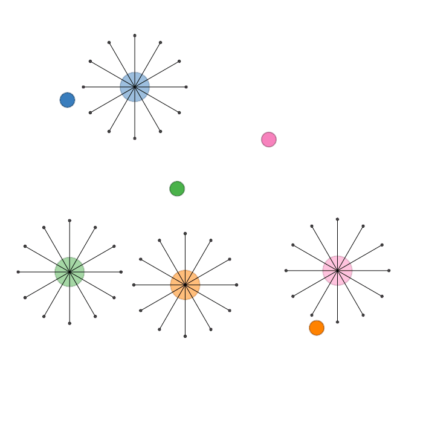
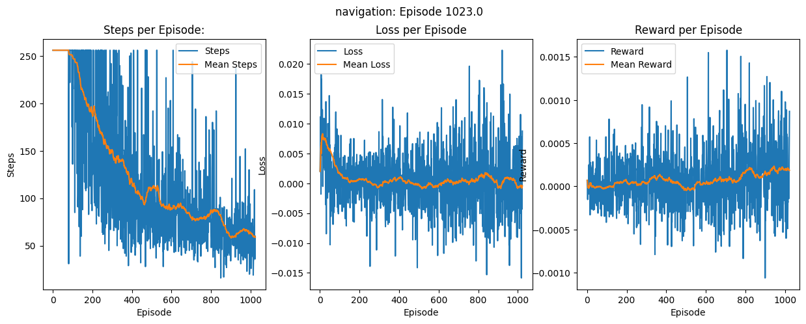

# Reinforcement Learning for Multiple Agents

This repository focuses on **Reinforcement Learning (RL)** techniques applied to **multi-agent systems**. It includes implementations, experiments, and simulations aimed at solving complex problems involving multiple interacting agents.

## Overview

This respository contains the different algorithms used to try and solve problems that require multiple agents to interact with each other within an environment.

The main algorithm used to solve this problem is Proximal Policy Optimization (PPO).